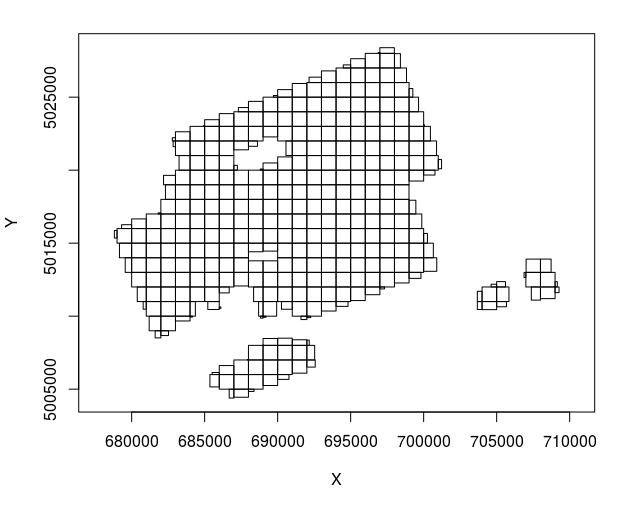

A catalog is a R class enabling the user to deal with several las files (tiles) contained in a folder loading only the file headers. The official package documentation in R does not provide runnable example because it requires to provide several las files.  The lidR package provides only one files as an example dataset.

A catalog is the representation of a set of las files. **A computer cannot load all the data at thet same time**. A catalog is a simple way to manage all the files sequentially reading only the headers. See the [public documentation of las file format](http://www.asprs.org/wp-content/uploads/2010/12/LAS_1_4_r13.pdf) for more information.

# Create a Catalog

````r
catalog = Catalog("<Path to a folder containing a set of las or laz files>")
head(catalog@headers)
````

A Catalog object contains a data.frame in the slot `@headers` with the 
data read from the headers of all user's las/laz files. A column  `filename` is also dedicated to the reference of the files path.

# Plot a Catalog

Based on the metadata contained in the las file. The plot function draw the rectangular hull of each files.

````r
plot(catalog)
````
    


# Select files in a Catalog

The interactive function `select_tiles` enable the user to click with the mouse on the desired tiles. This function works at least in RStudio. It has never be tested in other environnement. When the selection is done, the user must press the button that appears above the map to indicate that its selection is ended. Then the selected tiles are colorized in red and the function returns a `Catalog` object containing only the desired tiles. Then, these tiles can be loaded with the [readLAS](loadLidar.html) function.

````r
selectedTiles = select_tiles(catalog)
lidar = readLAS(selectedTiles)
````
    


# Process all the file of a Catalog

The function `processParallel` enable to analyse all the tiles of a catalog. The behaviours of the function are different on Unix (GNU/Linux) and Windows platform. Read the documentation for technical details.

## Create your own process function

The input of the `processParallel` function is a function. This function must be defined by the user and must have a single parameter which is the name of a las or laz file. Then, the user can do whatever he want in this function. Typically, open the las files and process it. The following example is very basic (see also [gridmetrics](gridmetrics.html)).

````r
analyse_tile = function(LASFile)
{
   # Load the data
  lidar = readLAS(LASFile)
    
  # compute my metrics
  metrics = gridmetrics(lidar, 20, myMetrics(X,Y,Z,Intensity,ScanAngle,pulseID))
    
  return(metrics)
}
````
    
Obviously the function can be more complicated. For example it can filter lakes from shapefile (see also [classifyFromShapefile](classifyFromShapefile.html)).
The function `myMetrics` must be written by the user too (see also [gridmetrics](gridmetrics.html)).

## Apply this function on the catalog

By default it detects how many core you have. But you can add an optional parameter `mc.core = 3`. For technical reasons explained in the documentation, the code for Unix (GNU/Linux and Mac) users differ from those for Windows users. Note that code for Windows works for both platform but not the opposite. Read the documentation carefully.

#### Unix

````r
output = project %>% processParallel(analyse_tile)
````

#### Windows

In windows mode, the child process cannot access to a shared memory. So, users must export their object themselves. Read the documentation carefully.

````r
export = c("readLAS", "gridmetrics", "myMetrics")
output = project %>% processParallel(analyse_tile, varlist = export)
````
    
# Extract a ground inventory

Ground inventory are usually done on circular areas. To make the link between lidar data an ground inventory data users need to extract the lidar data associated with the ground inventory. The `roi_query` function enable to extract regions of interest (ROI) from a lidar dataset splitted in several files.

The `roi_query` function expect a `Catalog` object as input as well as the `x` and `y` coordinates of the center of the ROIs and the associated dimensions of the ROIs. The field `roinames` can contain a unique name for each ROI enabling to label the ouputed list.

```r
catalog = Catalog("<Path to a folder containing a set of las or laz files>")

# Get coordinates from an external file
X = runif(30, 690000, 800000)   # X coordinates
Y = runif(30, 5010000, 5020000) # Y coordinates
R = 25                          # Radius of the plots

# Return a List of 30 circular LAS objects of 25 m radius
#' catalog %>% roi_query(X, Y, R)
```

An internal algorithm will determine wich files must be loaded. For those plots falling between two or more tiles the algotithm is able to detect that and will load the appropriate files to extract automatically every plot.

The circular ROI is not the only avaible shape. Rectangular ROIs are also possible. Check out the doc.

The function return a list of `LAS` objects.
