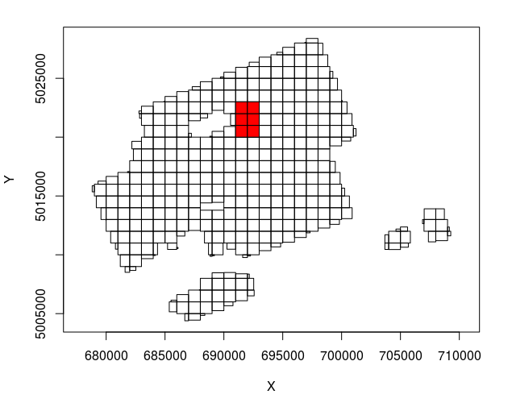

A catalog is an R class enabling the user to deal with several las files (tiles) contained in a folder by loading only the file headers. The official package documentation in R does not provide a runable example because it requires several las files to be provided. The lidR package provides only one file as an example dataset.

A catalog is the representation of a set of las files. **A computer cannot load all the data at the same time**. A catalog is a simple way to manage all the files sequentially reading only the headers. See the [public documentation of las file format](http://www.asprs.org/wp-content/uploads/2010/12/LAS_1_4_r13.pdf) for more information.

# Create a Catalog

````r
catalog = Catalog("<Path to a folder containing a set of las or laz files>")
head(catalog@headers)
````

A Catalog object contains a data.frame in the slot `@headers` with the 
data read from the headers of all user's las/laz files. A column  `filename` is also dedicated to the reference of the files path.

# Plot a Catalog

Based on the metadata contained in the las file. The plot function draws the rectangular hull of each files.

````r
plot(catalog)
````
    


# Select files in a Catalog

The interactive function `tiles_select` enables the user to click with the mouse on the desired tiles. This function works in RStudio, but it has not been tested in other environments. Once tiles have been selected, the user must press the button that appears above the map to indicate that the selection is complete. The selected tiles are then colorized in red and the function returns a `Catalog` object containing only the desired tiles. Then, these tiles can be loaded with the [readLAS](loadLidar.html) function.

````r
selectedTiles = tiles_select(catalog)
lidar = readLAS(selectedTiles)
````
    


# Process all the files in a Catalog

The function `process_parallel` enablea users to analyse all the tiles in a catalog. The behaviour of the function differs between Unix (GNU/Linux) and Windows platforms. Please read the documentation for technical details.

## Create your own process function

The input of the `process_parallel` function is a function. This function must be defined by the user and must have a single parameter which is the name of a las or laz file. The function can therefore be used for any user-defined purpose. Typically, to open the las files and process them. The following example is very basic (see also [gridmetrics](gridmetrics.html)).

````r
analyse_tile = function(LASFile)
{
   # Load the data
  lidar = readLAS(LASFile)
    
  # compute my metrics
  metrics = grid_metrics(lidar, 20, myMetrics(X,Y,Z,Intensity,ScanAngle,pulseID))
    
  return(metrics)
}
````
    
Obviously, the function can be more complicated. For example, it can filter lakes from a shapefile (see also [classifyFromShapefile](classifyFromShapefile.html)).
The function `myMetrics` must be written by the user too (see also [gridmetrics](gridmetrics.html)).

## Apply this function on the catalog

By default it detects how many core you have. But you can add an optional parameter `mc.core = 3`. For technical reasons explained in the documentation, the code for Unix (GNU/Linux and Mac) users differs from that for Windows users. Note that code for Windows works for both platforms, but the opposite is not the case. Please read the documentation carefully.

#### Unix

````r
output = project %>% processParallel(analyse_tile)
````

#### Windows

In windows mode, the child process cannot access shared memory. So, users must manually export their objects. Please read the documentation carefully.

````r
export = c("readLAS", "grid_metrics", "myMetrics")
output = project %>% processParallel(analyse_tile, varlist = export)
````
    
# Extract a ground inventory

Ground inventories are usually done on circular areas. To make the link between lidar data and ground inventory data, users need to extract the lidar data associated with the ground inventory. The `roi_query` function enables extraction of regions of interest (ROI) from a lidar dataset split into several files.

The `roi_query` function expects a `Catalog` object as input as well as the `x` and `y` coordinates of the center of the ROIs and the ROI's associated dimensions. The field `roinames` can contain a unique name for each ROI enabling labeling of the outputted list.

```r
catalog = Catalog("<Path to a folder containing a set of las or laz files>")

# Get coordinates from an external file
X = runif(30, 690000, 800000)   # X coordinates
Y = runif(30, 5010000, 5020000) # Y coordinates
R = 25                          # Radius of the plots

# Return a List of 30 circular LAS objects of 25 m radius
#' catalog %>% roi_query(X, Y, R)
```

An internal algorithm will determine wich files must be loaded. For those plots falling between two or more tiles the algotithm is able to detect that and will load the appropriate files to extract automatically every plot.

The circular ROI is not the only avaible shape. Rectangular ROIs are also possible. Check out the doc.

The function return a list of `LAS` objects.
