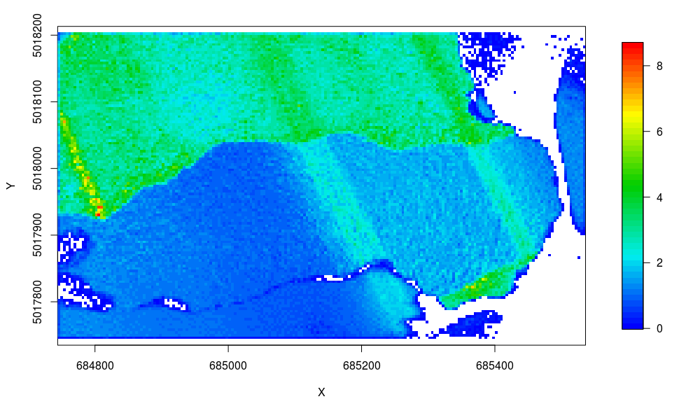
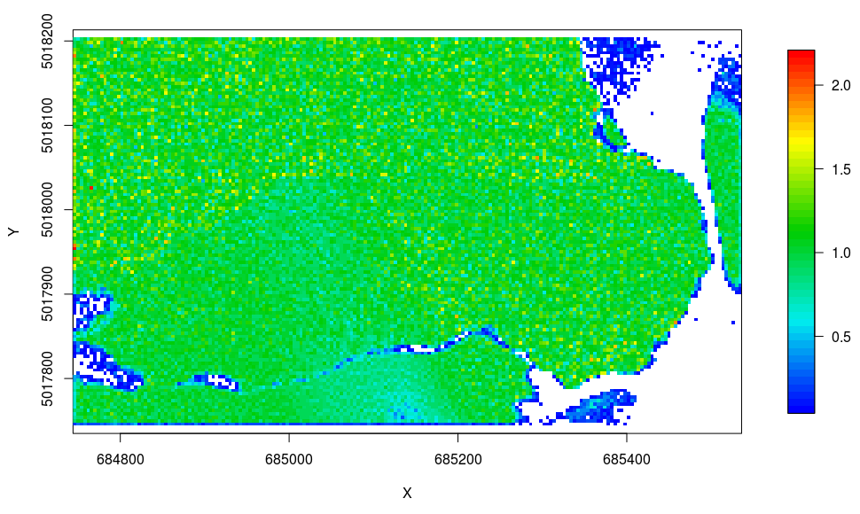
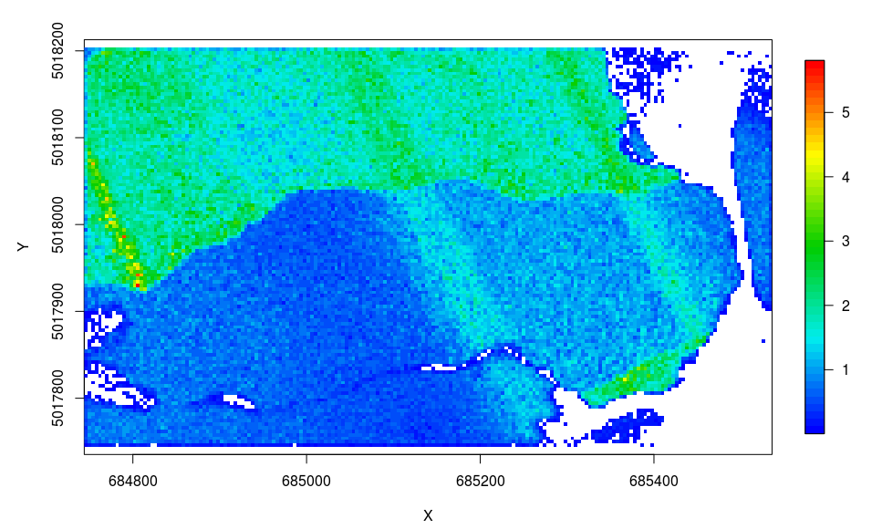

`thin` is designed to reduce the pulse density of a dataset. Thin can produce output data sets that have uniform pulse densities throughout the coverage area. It can also reduce the pulse density to reach a given pulse density for the whole dataset area.

## Pulse density map

The function `grid_density` enables mapping of the pulse density. In the example dataset we can observe that the pulse density is not homogeneous due to overlaps and aircraft pitch.

```r
lidar %>% grid_density %>% plot
```



## Thin homogeneously

The `thin` function by default rasterizes the space. For each cell (raster), the proportion of pulses that will be retained is computed using the calculated pulse density and the desired pulse density. Then, pulses are randomly removed in each cell. The input cell size must be large enough to compute a coherent local pulse density. 

    thinned = lidar %>% thin(density = 1, resolution = 5)
    thinned %>% grid_density %>% plot
    


In this figure we can observe that the new thinned lidar dataset now has an homogeneous pulse density. In areas where the required pulse density is greater than the local pulse density it returns an unchanged set of points (it cannot increase the pulse density).

## Thin non-homogeneously

If the optional parameter `homogenize` is set to `FALSE`, the algorithm used to thin the data will randomly remove pulses to reach a given pulse density across the entire dataset. In this case the pattern of pulse density variations is preserved.

    thinned = lidar %>% thin(1, homogenize = FALSE)
    thinned %>% grid_density %>% plot
    

